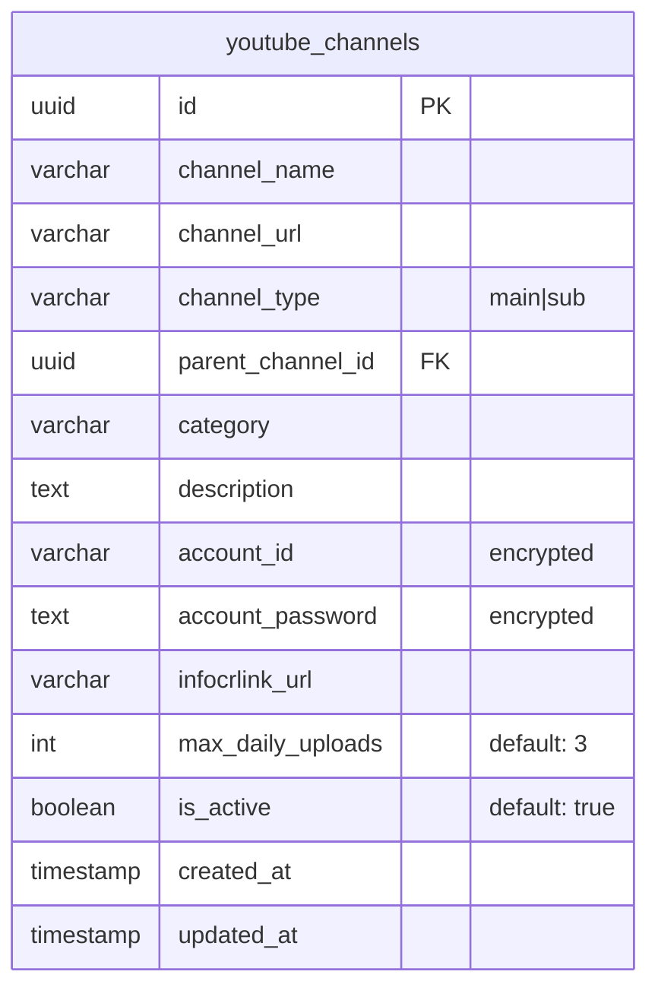
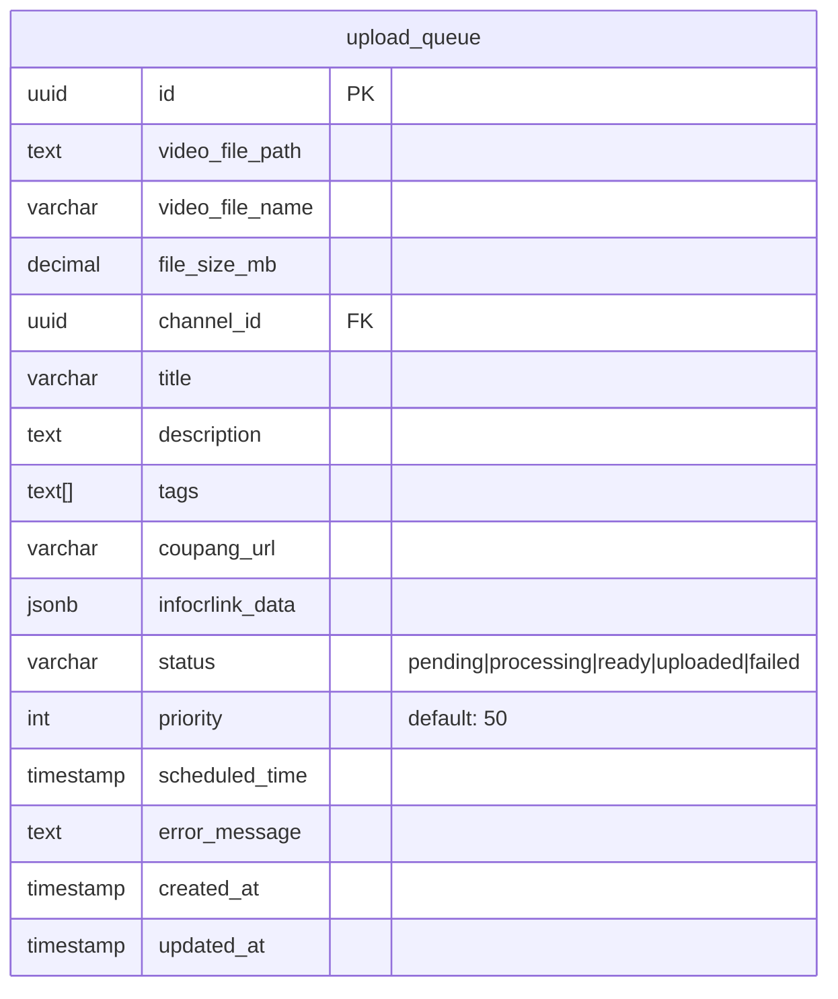
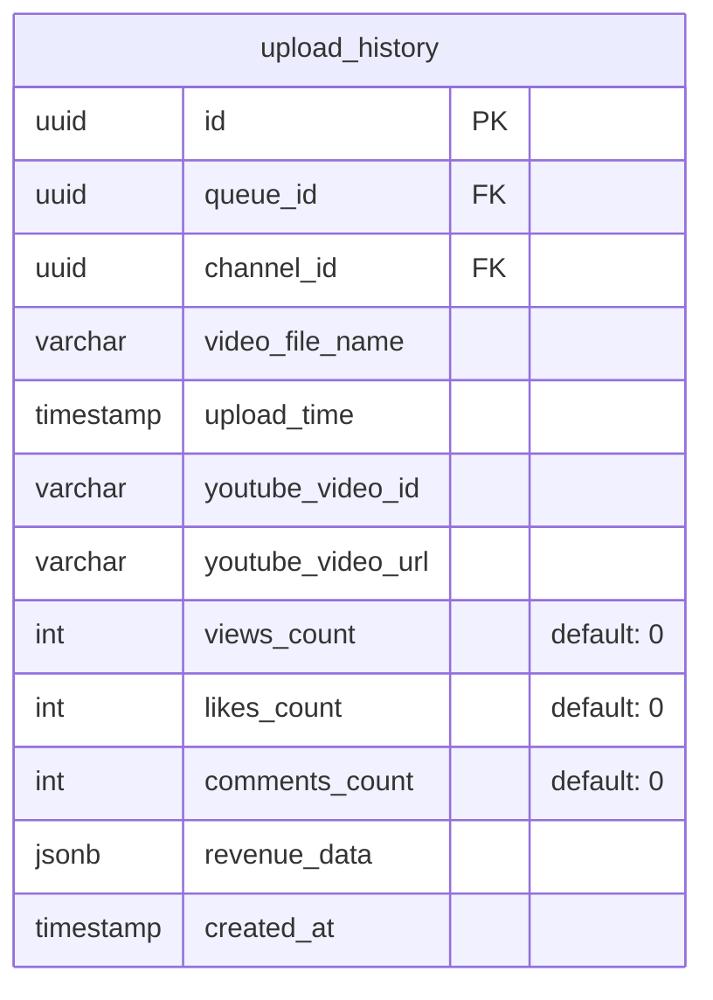
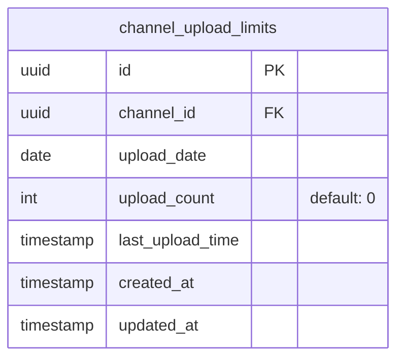
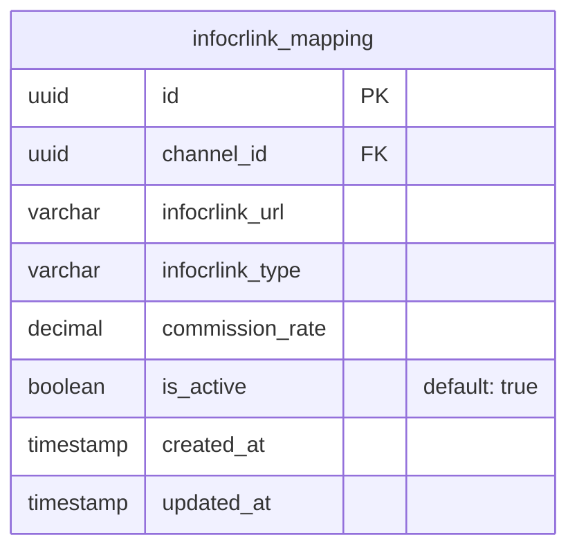
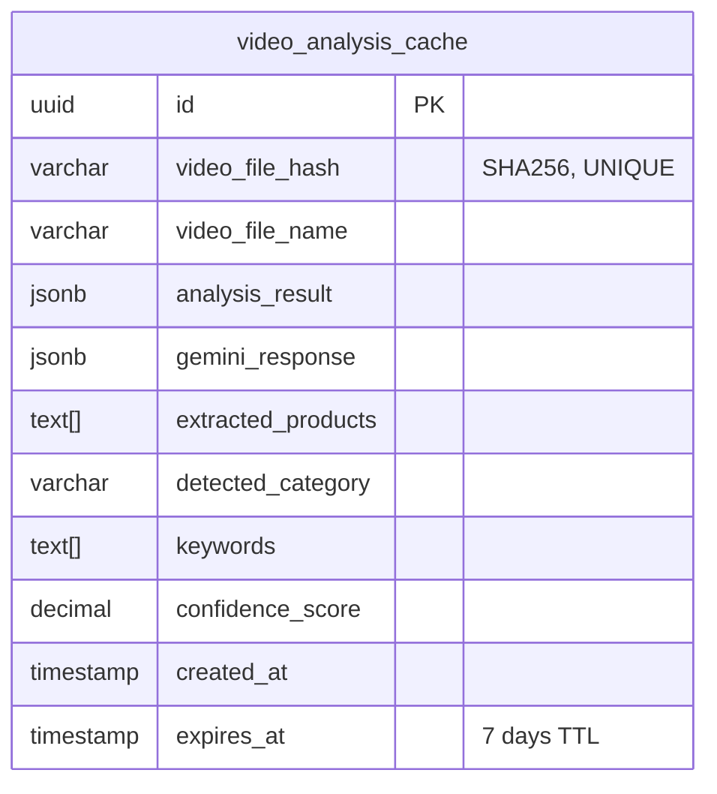
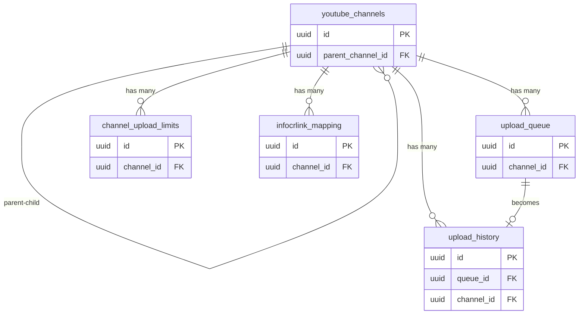

# UGC Video Manager - Database Schema Documentation

> 📊 **Last Updated**: 2025-08-28  
> 🗄️ **Database**: Supabase PostgreSQL  
> 📁 **SQL Script**: `/scripts/setup_database.sql`

## 📋 Overview

This document provides a visual representation of the database schema for the UGC Video Manager system. The schema is designed to efficiently manage YouTube channels, video upload queues, and upload history with built-in rate limiting.

## 🗂️ Database Tables

### 1. 📺 youtube_channels
Main table for storing YouTube channel information and credentials.



**Key Features:**
- Hierarchical channel structure (main/sub channels)
- Encrypted credential storage
- Category-based organization
- Upload limit configuration per channel

**Indexes:**
- `idx_channel_category` - Fast category filtering
- `idx_channel_active` - Active channel queries
- `idx_channel_type` - Channel type filtering
- `idx_parent_channel` - Parent-child relationships

---

### 2. 📝 upload_queue
Queue management for pending video uploads.



**Key Features:**
- Priority-based queue processing
- Scheduled upload support
- Rich metadata storage
- Error tracking

**Indexes:**
- `idx_queue_status` - Status filtering
- `idx_queue_priority` - Priority sorting
- `idx_queue_scheduled` - Scheduled time queries
- `idx_queue_channel` - Channel-based filtering
- `idx_queue_created` - Chronological ordering

---

### 3. 📈 upload_history
Historical record of all completed uploads.



**Key Features:**
- Complete upload tracking
- Performance metrics storage
- Revenue tracking capability

**Indexes:**
- `idx_history_channel` - Channel performance analysis
- `idx_history_date` - Time-based queries
- `idx_history_queue` - Queue traceability

---

### 4. 🚦 channel_upload_limits
Daily upload limit tracking per channel.



**Key Features:**
- Daily limit enforcement (24h/3 uploads)
- Automatic reset at midnight
- Last upload tracking

**Constraints:**
- `UNIQUE(channel_id, upload_date)` - One record per channel per day

**Indexes:**
- `idx_limits_date` - Date-based queries
- `idx_limits_channel_date` - Composite index for efficient lookups

---

### 5. 🔗 infocrlink_mapping
InfoCrLink URL mapping for channels.



**Key Features:**
- Multiple InfoCrLink URLs per channel
- Commission rate tracking
- Active/inactive status management

**Indexes:**
- `idx_infocrlink_channel` - Channel-based queries
- `idx_infocrlink_active` - Active link filtering

---

### 6. 🎬 video_analysis_cache
Cache for Gemini Vision API analysis results.



**Key Features:**
- Prevents redundant API calls
- 7-day automatic expiration
- Hash-based duplicate detection

**Indexes:**
- `idx_analysis_hash` - Fast hash lookups
- `idx_analysis_expires` - Expiration management

---

## 🔄 Table Relationships



---

## 📊 Database Views

### 1. **available_channels**
Shows channels that haven't reached their daily upload limit.

```sql
SELECT 
    channel_info.*,
    today_uploads,
    remaining_uploads
WHERE remaining_uploads > 0
```

### 2. **queue_status_overview**
Aggregated view of queue status.

```sql
SELECT 
    status,
    count,
    oldest_item,
    newest_item
GROUP BY status
```

### 3. **channel_statistics**
Performance metrics per channel.

```sql
SELECT 
    channel_id,
    channel_name,
    total_uploads,
    uploads_last_7_days,
    uploads_last_30_days,
    total_views,
    avg_views_per_video
```

---

## 🔧 Database Functions

### check_channel_upload_limit(channel_id)
```sql
-- Returns: BOOLEAN
-- Checks if channel can upload more videos today
```

### increment_upload_count(channel_id)
```sql
-- Returns: VOID
-- Increments the upload count for today
```

### update_updated_at_column()
```sql
-- Trigger function
-- Automatically updates updated_at timestamp
```

---

## 🔒 Security Features

### Row Level Security (RLS)
- ✅ Enabled on all tables
- 🔐 Policies for authenticated users
- 👤 Anon users: Read-only access

### Encryption
- 🔑 Account credentials: AES-256 encryption
- 🛡️ Sensitive data protection

---

## 📝 Usage Examples

### Check Channel Availability
```sql
-- Get all available channels for upload
SELECT * FROM available_channels 
WHERE category = 'technology'
ORDER BY remaining_uploads DESC;
```

### Add to Upload Queue
```sql
-- Add new video to queue
INSERT INTO upload_queue (
    video_file_path,
    video_file_name,
    channel_id,
    title,
    description,
    tags,
    priority
) VALUES (
    '/videos/product_review.mp4',
    'product_review.mp4',
    'channel-uuid-here',
    'Amazing Product Review 2025',
    'Detailed description...',
    ARRAY['tech', 'review', '2025'],
    75
);
```

### Track Upload Completion
```sql
-- Move from queue to history
INSERT INTO upload_history (
    queue_id,
    channel_id,
    video_file_name,
    upload_time,
    youtube_video_id
)
SELECT 
    id,
    channel_id,
    video_file_name,
    NOW(),
    'yt-video-id-here'
FROM upload_queue
WHERE id = 'queue-uuid-here';

-- Update queue status
UPDATE upload_queue 
SET status = 'uploaded'
WHERE id = 'queue-uuid-here';

-- Increment channel limit
SELECT increment_upload_count('channel-uuid-here');
```

---

## 🚀 Setup Instructions

### 1. Using Supabase Dashboard
1. Navigate to SQL Editor in Supabase Dashboard
2. Copy contents from `/scripts/setup_database.sql`
3. Execute the script

### 2. Using Supabase CLI
```bash
# Initialize Supabase (if not done)
supabase init

# Link to your project
supabase link --project-ref your-project-ref

# Run migration
supabase db push scripts/setup_database.sql
```

### 3. Using Direct Connection
```bash
# Connect via psql
psql -h your-supabase-host -U postgres -d postgres < scripts/setup_database.sql
```

---

## 📈 Performance Considerations

### Optimization Tips
1. **Batch Operations**: Process multiple videos in single transactions
2. **Cache Usage**: Utilize video_analysis_cache to reduce API calls
3. **Index Maintenance**: Run `ANALYZE` periodically for query optimization
4. **Cleanup Jobs**: Schedule removal of expired cache entries

### Monitoring Queries
```sql
-- Check queue backlog
SELECT * FROM queue_status_overview;

-- Monitor channel usage
SELECT * FROM channel_statistics 
ORDER BY uploads_last_7_days DESC;

-- Find bottleneck channels
SELECT * FROM available_channels 
WHERE remaining_uploads = 0;
```

---

## 🔄 Version History

| Version | Date | Changes |
|---------|------|---------|
| 1.0 | 2025-08-28 | Initial schema design |
| | | - 6 core tables |
| | | - 3 views |
| | | - 2 functions |
| | | - RLS policies |

---

## 📚 Related Documentation

- 📖 [Technical Specification](./TECHNICAL_SPECIFICATION.md)
- 🔧 [API Documentation](./docs/API.md)
- 🚀 [Setup Guide](./docs/SETUP.md)
- 📝 [Claude.md](./claude.md) - AI Assistant Context

---

## 🤝 Contributing

When modifying the database schema:

1. Update `/scripts/setup_database.sql`
2. Update this documentation
3. Create migration script if needed
4. Test in development environment
5. Document changes in version history

---

*This document is automatically updated when database schema changes occur.*